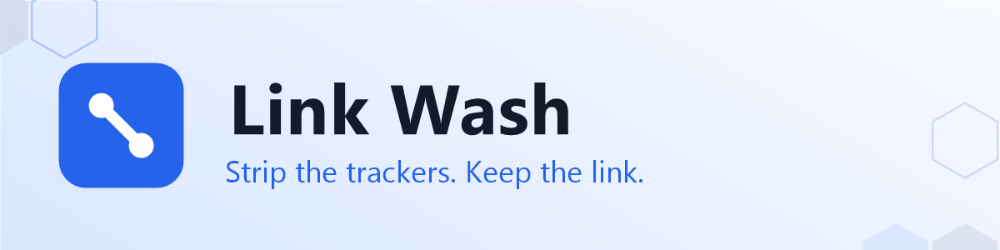
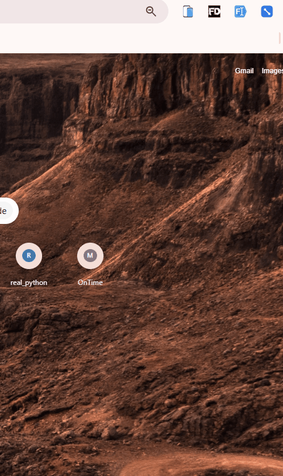
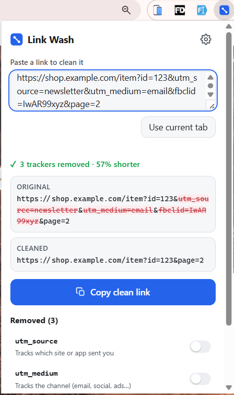
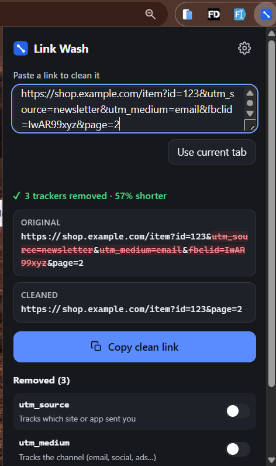

#  Link Wash

**Strip tracking junk from any link — instantly, and entirely on your device.**

Right-click any link to copy a clean version, or paste a link into the popup to
see exactly what gets removed. No accounts, no analytics, **no network requests.**

> Link Wash does **one thing well**: it removes tracking parameters (`utm_source`,
> `fbclid`, `gclid`, and friends) from URLs without breaking the link.

[Source on GitHub](https://github.com/Its-sultan/Link_Wash) · MIT licensed · zero dependencies





| Light | Dark |
|:---:|:---:|
|  |  |

<!-- More art and the screenshot recipe live in docs/. -->

---

## Why

Marketers append tracking parameters to links so they can follow who clicked,
which campaign worked, and who shared a link. Link Wash removes that cruft,
leaving a shorter, tidy, private URL — **without** stripping parameters the page
actually needs (like `id=123`, `v=`, `q=`, `page=`).

**Core principles:**

- **One job, done well.** Clean URLs. No QR codes, no encoders, no redirect
  followers, no "toolkit." If a feature would need a network request, it doesn't
  belong here.
- **100% local & private.** Zero network calls, zero analytics, zero accounts —
  verifiable as zero requests in DevTools.
- **Fewest permissions possible.** Every permission is justified below.
- **Never break a link.** When unsure whether a param is tracking or functional,
  Link Wash **keeps it**.

---

## Install (Load unpacked — no build step)

Link Wash is plain ES modules and CSS. There is **nothing to compile**.

1. Clone or download this repo.
2. Open `chrome://extensions` (or `edge://extensions`).
3. Turn on **Developer mode** (top right).
4. Click **Load unpacked** and select the **`src/`** folder.
5. Pin **Link Wash** to your toolbar. Done.

To package for the store: `npm run zip` produces `link-wash.zip`.

---

## How to use it

**Right-click (the star feature).** Right-click any link → **Copy clean link**.
Right-click empty page space → **Copy clean link to page**. A small **✓**
badge confirms the copy.

**Popup (paste-to-clean).** Click the toolbar icon, paste a link. It cleans as
you type and shows:

- a **summary** up top — e.g. *"3 trackers removed · 46% shorter"* — so the win
  registers before the details;
- a **before / after** comparison with removed parts struck through;
- a **restore list**: every removed parameter with a plain-language explanation
  and a **toggle to keep it** — flip one on and it returns to the link, with the
  strike-through fading out live. Great for the odd `utm` or affiliate ref you
  actually rely on.

**Use current tab** fills in the page you're on. Auto-copy (below) fires only on
a deliberate paste / *Use current tab*, never mid-typing, so it won't quietly
clobber your clipboard while you edit.

**Settings** (in the popup's ⚙ drawer, or the full options tab):

| Setting | Default | What it does |
| --- | --- | --- |
| Auto-copy on clean | **On** | Copies the cleaned link when you paste one (or use *Use current tab*). Never fires while you're typing. |
| Aggressive mode | Off | Also strips `ref`-style params (see the tradeoff below). |
| Unwrap redirect links | Off | Pulls the real destination out of a wrapper link — **decodes the text only, never visits the link.** |
| Your own parameters | — | Add any extra param name you want removed. |

---

## Permissions (and why each one is needed)

Link Wash requests the **minimum** set. It deliberately requests **no** host
access, no `tabs` history, no `webRequest`, no `cookies`, and nothing network-related.

| Permission | Why it's needed |
| --- | --- |
| `contextMenus` | The right-click **Copy clean link** items. |
| `clipboardWrite` | To write the cleaned URL to your clipboard. |
| `storage` | To save your settings and custom parameter list (`chrome.storage.local`). |
| `activeTab` | To read the **current tab's URL** on demand when you click *Use current tab* or *Copy clean link to page*. Grants access only to the active tab, only when you act. |
| `offscreen` | MV3 service workers have no DOM. A hidden offscreen document is the documented, permission-light way to copy to the clipboard from the right-click handler. |

**Not requested (on purpose):** `<all_urls>`, `tabs`, `webRequest`, `cookies`,
`history`, or any network/host permission.

---

## Privacy statement

**Link Wash makes zero network requests. Everything is computed locally.**

All cleaning happens in a pure JavaScript function ([`src/lib/cleaner.js`](src/lib/cleaner.js))
that runs on your machine. There are no analytics, no telemetry, no accounts, and
no remote rule updates. You can verify this yourself: open DevTools → **Network**
while using the extension and watch it stay empty. The entire codebase is small
and dependency-free precisely so you can audit it in one sitting.

Full policy: [PRIVACY.md](PRIVACY.md).

---

## What it intentionally does **NOT** do (and why)

These are different products. Bolting them on would dilute the one job, add
permissions, or — worst of all — require network access. Left out on purpose:

- **No QR-code generation.** A separate concern; adds UI noise.
- **No URL encode/decode tools.** That's a developer utility, not link hygiene.
- **No domain/WHOIS inspector.** Would need network access — a non-starter.
- **No redirect *checker* that pings servers.** Link Wash unwraps redirects by
  **decoding the string locally**; it will never *visit* a link. A checker that
  follows redirects over the network breaks the privacy promise.
- **No batch-file uploads / bulk processing.** Keeps the UI to one calm action.

Keeping the scope this tight is the feature.

---

## Add your own rules

The denylist lives in [`src/lib/rules.js`](src/lib/rules.js) and is structured so
adding a parameter is a **one-line change**:

```js
// In TRACKING_PARAMS — [param name, plain-language explanation]
['my_tracker', 'What this parameter tracks'],
```

- `TRACKING_PARAMS` — exact param names (matched case-insensitively).
- `TRACKING_PREFIXES` — strip anything starting with a prefix (e.g. `utm_`).
- `AGGRESSIVE_PARAMS` — `ref`-style params, only stripped in aggressive mode.
- `FRAGMENT_TRACKERS` — known trackers inside a `#a=b` fragment.

Prefer not to edit code? Use **Settings → Your own parameters to remove**.

### The `ref` tradeoff

Some sites genuinely route on `ref`/`source`-style params (referral and affiliate
programs, share attribution that changes behavior). Because removing them can
*change where a link goes*, Link Wash **keeps them by default** and only strips
them when you turn on **Aggressive mode**. Correctness beats aggressiveness.

---

## Develop & test

The cleaning engine is a pure module, so it's fully unit-tested with **no
framework** — just Node's built-in test runner:

```bash
npm test     # runs tests/cleaner.test.mjs via `node --test`
npm run lint # zero-dependency syntax check of every JS file
npm run zip  # package src/ into link-wash.zip
```

There are **no runtime dependencies** and **no build step** — that's deliberate,
so the shipped code is exactly the code you read.

### Project structure

```
src/
  manifest.json
  background/service-worker.js   context menus + clipboard + badge
  lib/cleaner.js                 pure engine: cleanUrl()
  lib/rules.js                   the denylist + explanations (extend here)
  lib/settings.js                shared settings (chrome.storage.local)
  lib/clipboard.js               MV3-safe copy via offscreen document
  lib/browser-shim.js            chrome.* namespace (Firefox port seam)
  offscreen/                     hidden clipboard helper page
  popup/                         paste-to-clean UI
  options/                       full settings tab
  icons/                         16 / 32 / 48 / 128
tests/cleaner.test.mjs
scripts/                         lint.mjs, zip.mjs (dependency-free)
```

---

## Manual test checklist

Mirrors the automated suite plus the things only a human can click. See
[TESTING.md](TESTING.md).

---

## Roadmap

- **Firefox port.** The `chrome.*` namespace is funnelled through
  [`src/lib/browser-shim.js`](src/lib/browser-shim.js) so this is a small change.
- Optional richer per-host rules (kept conservative).
- Localized parameter explanations.

That's it. No "v2 toolkit." The goal is to stay small, sharp, and finished.

---

## License

[MIT](LICENSE).
